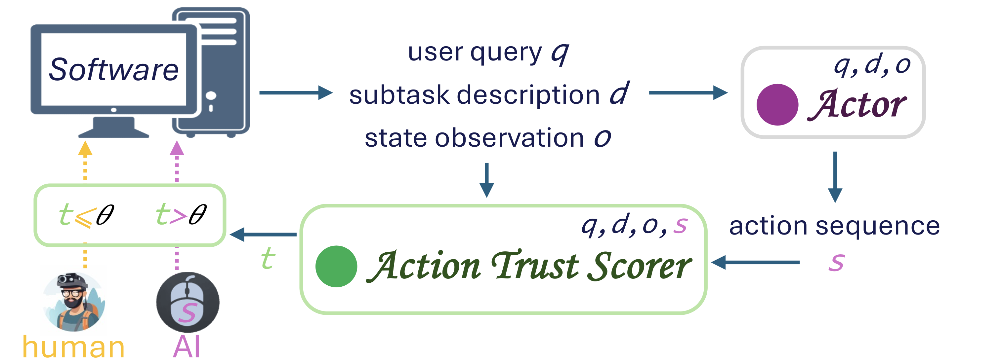
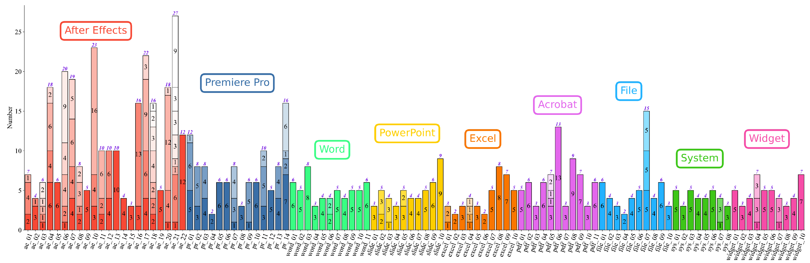
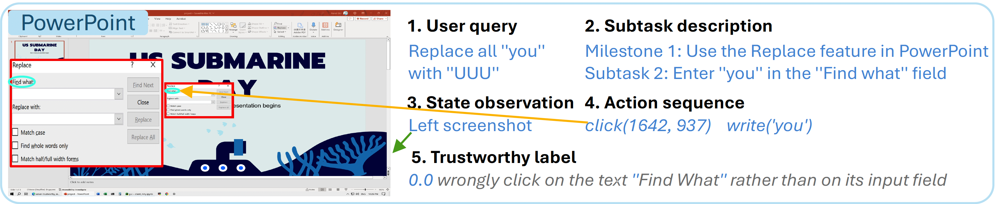
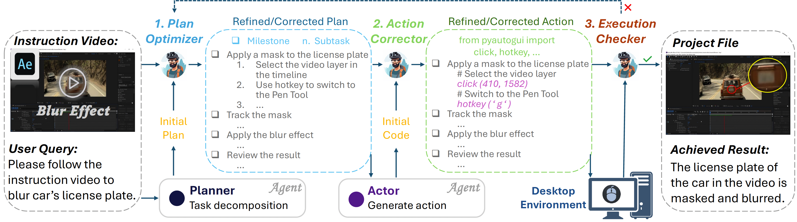

<p align="center">
    <h1 align="center">
        Can I Trust You?
        <br>
        Advancing GUI Task Automation with Action Trust Score
    </h1>
</p>

<p align="center">
  <a href="https://mhaiyang.github.io/">Haiyang Mei</a>&nbsp;&nbsp;&nbsp;
  <a href="https://scholar.google.com/citations?user=No9OsocAAAAJ&hl=en">Difei Gao</a>&nbsp;&nbsp;&nbsp;   
  <a href="https://scholar.google.com/citations?user=LRDKx5cAAAAJ&hl=en">Xiaopeng Wei</a>&nbsp;&nbsp;&nbsp;
  <a href="https://scholar.google.com/citations?user=YU2ujh4AAAAJ&hl=en">Xin Yang</a>&nbsp;&nbsp;&nbsp;  
  <a href="https://sites.google.com/view/showlab">Mike Zheng Shou</a><sup>✉️</sup>  
  <br>
  Show Lab, National University of Singapore
</p>

<div align="center">
  <p>
    <a href="https://dl.acm.org/doi/10.1145/3746027.3755618" target="_blank"> 
    </a>
    <a href="https://dl.acm.org/doi/10.1145/3746027.3755618" target="_blank">
      
    </a>
  </p>
</div>

<p align="center">
  <a href="https://dl.acm.org/doi/10.1145/3746027.3755618" target="_blank">
    </a>
</p>

- [Table of Contents](#0-table-of-contents)
  * [1. TrustScorer](#1-trustscorer)
  * [2. TrustBench](#2-trustbench)
  * [3. Implementation](#3-implementation)
  * [4. Acknowledgements](#4-acknowledgements)
  * [5. Citation](#5-citation)
  * [6. License](#6-license)
  * [7. Contact](#7-contact)

### 1. TrustScorer

We introduce **TrustScorer**, which evaluates the trustworthiness of GUI agent actions for selective
human intervention when action trust score is low, to help mingling human precision with AI efficiency.

<p align="center">
  
</p>

**TrustScorer** takes as input the user query _q_, subtask description _d_, action sequence _s_, and state observation _o_, and outputs a trustworthiness label _l_ indicating the likelihood that the action sequence can accomplish the specified subtask.

### 2. TrustBench
**TrustBench** includes 106 specific tasks from 9 commonly used applications as well as 718 agent action sequences along with the corresponding ground-truth annotations. 

<p align="center">
  
</p>

One TrustBench example on PPT:
<p align="center">
  
</p>

The annotation pipeline:
<p align="center">
  
</p>

**Dataset link:**
[ [OneDrive](https://1drv.ms/f/c/f6d9d790b8550d3f/IgD2F3EiQMLJRLiOfxVK75aqAXnzZwwMFl66LbR670GbUs8?e=tr2wAb) ]
[ [BaiduDisk](https://pan.baidu.com/s/1y3wlvKy9HBQhKijMNOuQsw?pwd=mm25) ].

### 3. Implementation
#### 3.1 Setup Environment
```
conda env create -f score_env.yml
pip install torch==2.3.0 torchvision==0.18.0 torchaudio==2.3.0 --index-url https://download.pytorch.org/whl/cu118
pip install -r requirements.txt
```

#### 3.2 Training
```
cd client/method/trustmodel
sh train.sh
```
The checkpoints will be saved under the `workdir` configured by hydra `client/method/trustmodel/conf/config.yaml`. The language model we use is a encoder-only [DeBERTa](https://arxiv.org/abs/2006.03654) model that outputs a score for a pair of query (task) and action (python code), and the implementation is based on SentenceTransformer's [Cross-Encoders](https://www.sbert.net/examples/training/cross-encoder/README.html).

**Model link:**
[ [OneDrive](https://1drv.ms/f/c/f6d9d790b8550d3f/IgC_qeHluCJ2S6tpaujl0nkUAVOG-H0TMIgmgWc4GFfavOg?e=rliACB) ]
[ [BaiduDisk](https://pan.baidu.com/s/1Ue6tKaT910-QKvdS1um5sw?pwd=mm25) ].

#### 3.3 Inference
- Prompting Method
```
cd client/method
python prompting_gpt4.py
python utils/format.py
```

- Training Method
```
cd client/method/trustmodel
python infer.py
python utils/format.py
```

#### 3.4 Visualization
0. generate ace_actions.json
```
cd ../../utils
python 0_sum_ace_actions.py
```

1. generate TF.json and ACC.txt
```
python 1_cal_score_accuracy.py
```

2. plot histogram.pdf
```
python 2_plot_histogram.py
```

3. generate {method_name}_actions.json
```
python 3_refine_actions.py
```

4. show {method_name}_actions.pdf
```
python 4_show_actions.py
python 4_show_ace_actions.py
```

5. generate curve_cost_sr.pdf
```
python 5_draw_curve_cost_sr.py
```

**Result link:**
[ [OneDrive](https://1drv.ms/f/c/f6d9d790b8550d3f/IgCDeT8J4fzcT7V7ZxVhe5qsASSo6K7ch34S8muiSkMdYvE?e=vdvFHV) ]
[ [BaiduDisk](https://pan.baidu.com/s/15-T-GAdkOIpN6FsW4L0EvQ?pwd=mm25) ].

### 4. Acknowledgements

Our work builds upon [AssistGUI](https://openaccess.thecvf.com/content/CVPR2024/papers/Gao_AssistGUI_Task-Oriented_PC_Graphical_User_Interface_Automation_CVPR_2024_paper.pdf).

### 5. Citation

If you use TrustScorer/TrustBench in your research, please use the following BibTeX entry.

```bibtex
@InProceedings{Mei_2025_MM_TrustScorer,
    author    = {Mei, Haiyang and Gao, Difei and Wei, Xiaopeng and Yang, Xin and Shou, Mike Zheng},
    title     = {Can I Trust You? Advancing GUI Task Automation with Action Trust Score},
    booktitle = {Proceedings of the 33rd ACM International Conference on Multimedia (ACM MM)},
    year      = {2025},
}
```

### 6. License

Please see `LICENSE`.

### 7. Contact
E-Mail: Haiyang Mei (haiyang.mei@outlook.com)

**[⬆ back to top](#1-trustscorer)**
